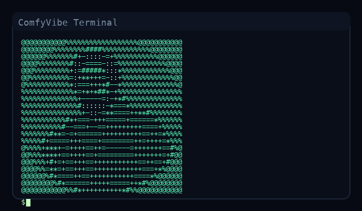

# ComfyVibes


**The creative engine of ComfyUI workflows without the complexity. Conversational UI. Automation. AI. Pure joy.**

ComfyVibes is for creative technologists, visual storytellers, and anyone who wants to push ComfyUI beyond the ordinary. This toolkit lets you explore the remarkable capabilities of ComfyUI without being boxed in by cryptic node graphs or technical hurdles. Have conversations with your workflows, experiment with generative visual storytelling, and discover new creative directions—no manual wrangling required. ComfyVibes is your bridge to a more intuitive, playful, and generative engagement with ComfyUI, where imagination leads and the platform follows.

---

ComfyVibes is your all-in-one toolkit for extracting, managing, running, and automating ComfyUI workflows—built for creative technologists, artists, and anyone who wants to do more with less friction. Powered by the Model Context Protocol (MCP), ComfyVibes transforms static workflows into living, breathing, automation-ready assets. Integrate with LLMs, orchestrate agentic pipelines, and say goodbye to tedious node wrangling forever.

---

**ComfyUI automation for creative technologists.**


ComfyVibes turns ComfyUI workflows into reusable, automation‑ready building blocks. It extracts workflows from artifacts, organizes them with metadata and param specs, and runs them through ComfyUI with live monitoring — all exposed as clean MCP tools for conversational engagement, agentic systems and, for you alpha geeks, IDE integrations.

<!--  -->

## Why ComfyVibes

- **Make workflows portable**: Extract from images or video artifacts and store them as structured, reusable assets.
- **Automate with confidence**: MCP‑native tool surface designed for LLMs, agents, and IDEs.
- **Run + observe**: Queue executions, track progress, and collect results programmatically.
- **Stay consistent**: Normalize formats, validate parameters, and preserve metadata.

## What You Can Do

- Extract workflows from ComfyUI artifacts.
- Import and catalog workflows with metadata.
- Patch parameters safely and run workflows on demand.
- Query ComfyUI for nodes, models, and embeddings.

---

## Developer Guide

### MCP Tool Surface

#### ComfyUI Read Tools

- `comfy_nodes_list`
- `comfy_queue_get`
- `comfy_history_get`
- `comfy_models_list`
- `comfy_models_get`
- `comfy_embeddings_list`

#### Workflow Tools

- `workflows.list`
- `workflows.get`
- `workflows.params.get`
- `workflows.save`
# ComfyVibes


## Why You'll Love ComfyVibes

- **✨ AI-Powered Automation**: Seamlessly connect to LLMs and let your workflows run themselves.
- **🚀 Effortless Extraction**: Instantly pull workflows from images, videos, or JSON—no manual digging required.
- **🎨 Creative Freedom**: Designed for fluid, intuitive, and playful exploration—no more rigid, technical UIs.
- **🔁 Save, Reuse, Remix**: Archive your best workflows as standalone JSON, ready to reload, remix, or share.
- **🌐 Broad Format Support**: Works with PNG, WebP, JPEG, MP4, and more—if ComfyUI made it, ComfyVibes can read it.
- **🧩 Plug-and-Play**: No ComfyUI runtime required. Use it anywhere, integrate it everywhere.

---

## Features

- 🤖 **MCP Wrapper for Automation**: Automate ComfyUI workflows with LLMs for next-level creative flexibility.
- 📸 **Extract Workflow Data**: Effortlessly extract from ComfyUI-generated media files.
- 🎬 **Run Workflows**: Execute workflows directly from extracted or saved data—iterate at the speed of thought.
- 💾 **Save and Reuse**: Archive workflows as JSON and bring them back to life anytime.
- 📊 **Workflow Intelligence**: Get deep insights into nodes, connections, and parameters.
- 🔧 **Standalone Operation**: No ComfyUI runtime dependencies—just pure workflow magic.

---


---

## Get Started in Seconds

### Installation

```bash
git clone https://github.com/bleeckerj/nfl-comfymcp.git
cd nfl-comfymcp
pip install -e .
```

### Run the MCP Server

```bash
python -m comfy_mcp.mcp_server.cli
```

### Extract a Workflow from an Artifact

```bash
python -m comfy_mcp.extraction.adapter extract_and_write ./artifact.png
```

### Run a Workflow (Python)

```python
from comfy_mcp.comfy_client import ComfyClient

client = ComfyClient(base_url="http://127.0.0.1:8188")
result = client.queue_prompt(
    workflow_file="./workflows/nebula_api.json",
    params={"prompt": "cosmic dusk", "width": 1024, "height": 768},
)
print(result)
```

---

## What Can You Do with ComfyVibes?

- Extract and catalog workflows from any ComfyUI artifact
- Automate workflow execution with LLMs and agents
- Patch parameters and run workflows on demand
- Query ComfyUI for nodes, models, and embeddings
- Build creative pipelines, IDE integrations, and more

---

## MCP Tool Surface (for Power Users)

### ComfyUI Read Tools

- `comfy.nodes.list`
- `comfy.queue.get`
- `comfy.history.get`
- `comfy.models.list`
- `comfy.models.get`
- `comfy.embeddings.list`

### Workflow Tools

- `workflows_list`
- `workflows_get`
- `workflows_params_get`
- `workflows_save`
- `workflows_delete`
- `workflows_run`
- `workflows_wait`
- `workflows_extract_from_artifact`
- `workflows_import_from_artifact`

---

## Roadmap

- Claude Code integration
- Codex integration
- VS Code integration
- Cursor workflows
- Notion pipelines
- Astro site kits
- Cloudflare deploy targets

---

## GitHub Pages

A marketing-forward landing page lives in `docs/`. Publish it via GitHub Pages (root `/docs`), or deploy with GitHub Actions using the workflow in `.github/workflows/pages.yml`.

## License

MIT
